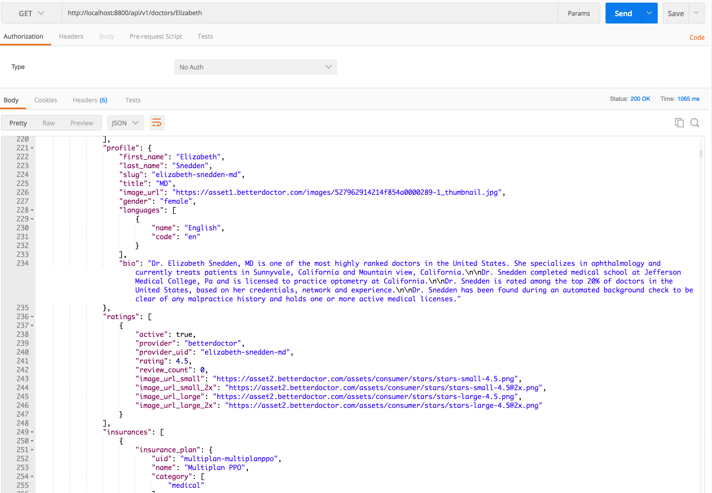
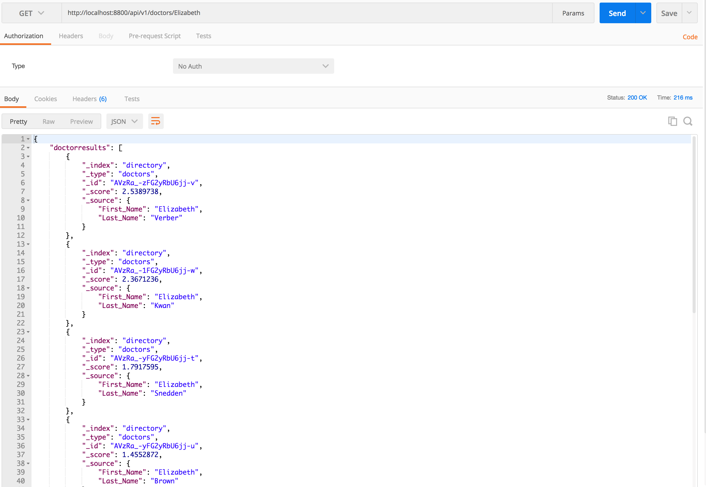

## Proxy Node.js API (to search doctors) with data persistence using Elastic Search ###

This is a node.js proxy API endpoint that calls the BetterDoctor API to search for doctors in an geographic area, and persists data using elasticsearch.


#### Instructions to setup and run

1. Run Elastic search server(default port 9100). 
1. [OPTIONAL] Install and run elasticsearch-head (web front end for Elasticsearch cluster) runs on port 9200. 
2. cd doctor_search/
3. Get your API keys and add to the server.js file.
4. Run ONCE to set up the directory index. 
```
$ node indexcreator.js 

```
5. Run to create express http server that runs at port 8800.
```
$ node server.js

```
6. Example - run in the browser address bar
```
http://localhost:8800/api/v1/doctors/firstname 

```
#### First Hit - Proxy API gets results from 3rd party API


#### Second Hit - API retrieves cached data from Elasticsearch

